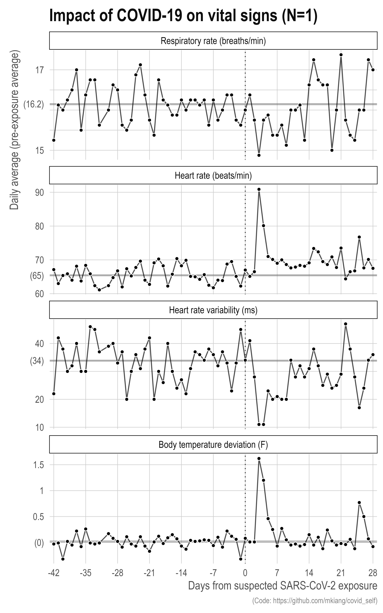
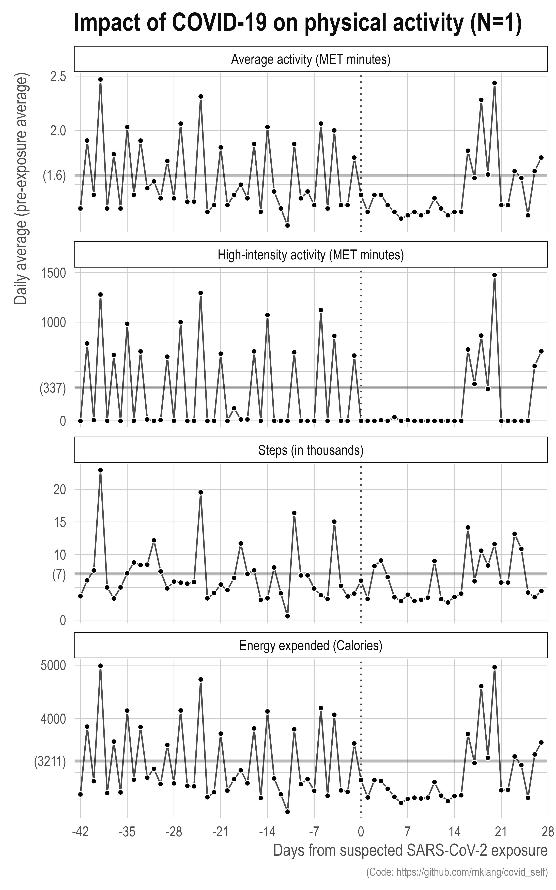

<!-- README.md is generated from README.Rmd. Please edit that file -->

## Impact of COVID-19 on my vital signs and physical activity

It finally happened — after over 2 years of avoiding COVID-19, I got it.
Here is some code I used to pull my Oura ring data from the [Oura
API](https://cloud.ouraring.com/v2/docs#operation/daily_activity_route_daily_activity_get)
and plot some common metrics. You need to run the code in order — the
first file pulls the raw API response as individual stream-day files.
The second file will compile the days into a single dataframe and plots
a few of the metrics.

Adjust as appropriate – you need your own API key (put it in
`./code/secrets.R`) and to specify your own start date (L8 of
`./code/01_pull_data.R`). The utility files for pinging the API are in
`./code/utils_api.R`. For obvious reasons, I’m not going to share my
personal data, but the code should work with minimal adjustment. The
code is horribly inefficient but I wrote most of it while in bed with a
fever so it is what it is. Errors likely.

I hope you don’t get COVID and the code is useful to somebody out there.

 

 

